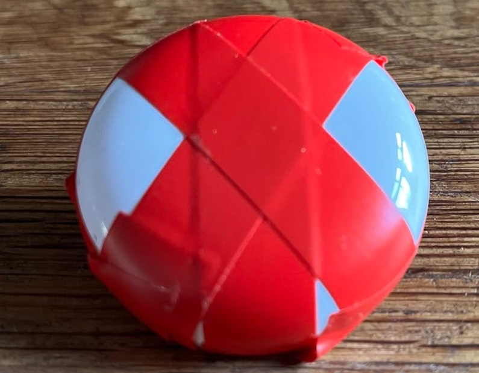

# PeePee Peep

Ever in the need of a bedwetting alarm? Want to keep the data to yourself? This is the repository that will help you to keep the data to yourself. All solutions are Home Assistant oriented.

## Commercial solution

### DryLy

Why start with a commercial bedwetting alarm if this is about DIY? Because this one is used as a reference. [DryLy](https://dryly.com/) is a cloud oriented bedwetting alarm. It allows you to use the alarm in offline mode, but then only the alarm transmitter communicates with the alarm receiver and you cannot receive an alarm on the device of your choosing. The alarm receiver is a Espressif device, so it could be hacked, but hardware hacking is not my cup of tea. I did some reasearch into the cloud API and I created a small POC in the [DryLy](dryly_watcher/README.md) folder that allows you to integrate DryLy into Home Assistant.

| ✅ Pros | ❌ Cons |
| ------- | ------- |
| It's ready to use.                                   | It's relatively expensive. |
| When internet is down, the alarm receiver will work. | Cloud oriented. |
| It can be integrated in Home Assistant.              | It's not a sensative alarm. |
| It can be used outside of your home.                 | You will need to charge it every other night. |

## DIY Bedwetting

## Aqara

You can use an [Aqara Water Leak Sensor](https://www.aqara.com/us/product/water-sensor/) and attach it to bedwetting underwear. You will still need special underwear to attach the device to, the DryLy underwear can be used perfectly if you'll use something to attach the sensor to. The perfect item to do this with is the [dubble connection component](https://www.speeltechniek.nl/Spektro-Dubbel-verbindingsonderdeel) from a game called Spektro. This component will stick to the underpants very well so it won't come loose at night.

Take a look at the [PeePee Peep automation](peepee-peep/README.md) example. It also has detection when the sensor is being unpaired from the zigbee network. See the cons why.

### How To:

1. Flip the Spektro connector and cut through the metal plate or else both buttons will be connected.
2. Unscrew the screws from the Aqara sensor, attach two wires
3. Attach/solder the wires to  the corresponding buttons of the Spektro component
4. Make sure the Aqara sensor is attached to the Spektro component, with tape for instance, and it will fit perfectly onto the DryLy underpants.
5. Make sure the Aqara sensor is added to the zigbee network with the router closes to the bed of the bedwetter.

  

| ✅ Pros | ❌ Cons |
| ------- | ------- |
| Completely local.                                 | It's attached to the zigbee network at home, so it can only be used at home. Therefor it cannot be used for sleepovers. |
| You can be alarmed before the whole bed is wet.   | You will need a seperate speaker to wake up the bed wetter. |
| It's cheaper then a commercial solution.          | If the alarm is being pushed for 5 seconds, it will disconnect from the zigbee network. It is hard to push it and it needs to be precise, so the chance it happens by accident is small but we've got murphy... |
| It can last more then a year on a CR2032 battery. | |

🧐 Good to know:
* The zigbee protocol is not correctly implemented in the Aqara Water Leak sensor, it will always to talk to the device that added the sensor to the zigbee network. You will need that zigbee router close to the bedwetter.
* You will need underpants to attach the sensor to
* It is very sensitive. It can trigger on sweat alone. It's best to wear underpants beneath the underwear it`s attached to.

## Mi Temperature and Humidity Monitor 2

With the [Mi Temperature and Humidity Monitor 2](https://ams.buy.mi.com/uk/item/3204500023), I have not done a live test but I have tested it with underpeants that I made slowly wetter. I have been testing it because I was searching for a less sensitive sensor. The Mi device is less sensitive, but seems to be more sensitive than DryLy. To get this to work, you will need to flash custom firmware from https://github.com/pvvx/ATC_MiThermometer. After flashing you will need to configure the following:

* Advertising type: BT Home v1 (depending on how it's going to be read)
* RS Mode: Switch
* RS Report interval: 1

Once you have done that, you can read the switch state from bluetooth. To get a switch state, 2 wires need to be soldered to the Ground and P8, those wires need to be attached/soldered to for instance the Spektro [dubble connection component](https://www.speeltechniek.nl/Spektro-Dubbel-verbindingsonderdeel). Take a look at the How To of the Aqara sensor on how to use the Spektor component. When done you will need to make the sensor water resistant. I think enough tape should work...

Another advantage of this device is that due to bluetooth is being used, it's possible to use an ESP32 device to read and report the switch state (see https://esphome.io/components/sensor/xiaomi_ble.html#lywsd03mmc for the advertising type, i do not know if the switch state is visible with PVVX, Custom or Mi Like). The ESP device that will read the sensor could be the [ESP Muse](https://www.amazon.com/RASPIAUDIO-ESPMUSE-Development-Speaker-Microphone/dp/B09N3S9S29) with a speaker integrated. Or you could go for a simple, cheaper, [Rtttl buzzer](https://esphome.io/components/rtttl.html). If one of these is used, the whole package can be used during sleepovers. You will need to program the ESP device to react to the switch state and play a sound on the speaker or buzzer.

| ✅ Pros | ❌ Cons |
| ------- | ------- |
| Completely local.                               | You will need a seperate speaker to wake up the bed wetter. |
| You can be alarmed before the whole bed is wet. | The sensor is not water resistant. |
| It is the cheapest solution.                    | Soldering is needed. |
| It can be used with sleepovers (not tested).    | You will need a bluetooth receiver. |
| It can last a year on a CR2032 battery.         | |

🧐 Good to know:
* You will need underpants to attach the sensor to

## Underwear

I have not ventured into this realm, but it is possible to create your own underwear with a sensor wire. All you need is being good at sewing, a wire (which could be [this](https://www.kiwi-electronics.com/en/stainless-thin-conductive-thread-2-ply-23-meter-2792) stuff) and buttons to attach the bedwetting alarm to. You will need 2 wires that are layed out besides each other, but do not touch. When the underpants get wet, the wetness will create the contact between the wires and the alarm will trigger on that.
The pattern could look more or less like this:

And here is an example how its done in a commercial solution, where you can see the wire on the front, it goes all the way down between the legs. The wires are also seperated by a seam. This seem to be the most common way to wire the alarm.

